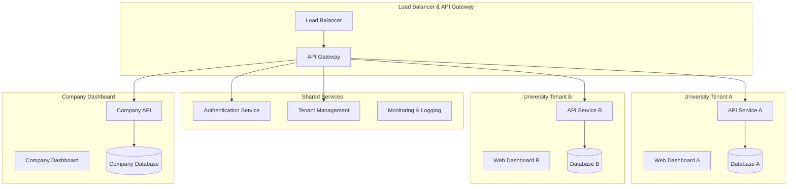
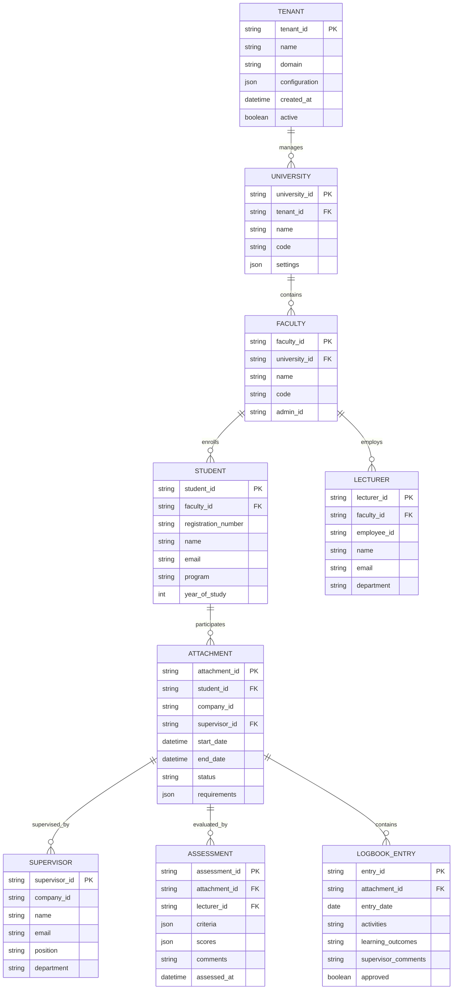

# Design Document: University Attachment Platform

## Overview

PractiCheck is a multi-tenant SaaS platform designed to manage industrial attachment programs for universities. The system employs a microservices architecture with containerized deployments, ensuring complete isolation between university tenants while providing role-specific dashboards for different stakeholders in the attachment process.

The platform supports six distinct user roles across multiple dashboards: Company Administrators (PractiCheck staff), Students, Lecturers, Industry Supervisors, Faculty Administrators, and University Administrators. Each university operates as an isolated tenant with dedicated resources and data separation.

## Architecture

### High-Level Architecture



### Containerization Strategy

Each university tenant runs in isolated Docker containers orchestrated by Kubernetes:

- **Namespace Isolation**: Each university gets its own Kubernetes namespace
- **Resource Quotas**: CPU, memory, and storage limits per tenant
- **Network Policies**: Strict network isolation between tenants
- **Persistent Volumes**: Dedicated storage for each tenant's database
- **Service Mesh**: Istio for secure inter-service communication

### Multi-Tenant Data Architecture



## Components and Interfaces

### 1. API Gateway and Load Balancer

**Responsibilities:**
- Route requests to appropriate tenant services
- Handle authentication and authorization
- Rate limiting and request throttling
- SSL termination and security headers

**Key Interfaces:**
```typescript
interface TenantRouter {
  routeRequest(request: HttpRequest): TenantEndpoint;
  validateTenant(tenantId: string): boolean;
  getHealthStatus(tenantId: string): HealthStatus;
}

interface AuthenticationGateway {
  authenticateUser(credentials: UserCredentials): AuthToken;
  validateToken(token: string): UserContext;
  refreshToken(refreshToken: string): AuthToken;
}
```

### 2. Tenant Management Service

**Responsibilities:**
- Provision new university tenants
- Manage tenant lifecycle and configuration
- Monitor tenant health and resource usage
- Handle tenant-specific deployments

**Key Interfaces:**
```typescript
interface TenantManager {
  createTenant(config: TenantConfiguration): TenantInstance;
  deployTenant(tenantId: string): DeploymentResult;
  scaleTenant(tenantId: string, resources: ResourceSpec): void;
  deleteTenant(tenantId: string): void;
}

interface KubernetesOrchestrator {
  createNamespace(tenantId: string): Namespace;
  deployServices(tenantId: string, manifests: K8sManifest[]): void;
  scaleDeployment(deployment: string, replicas: number): void;
  getResourceUsage(namespace: string): ResourceMetrics;
}
```

### 3. University Tenant Services

Each tenant includes these core services:

**Student Service:**
```typescript
interface StudentService {
  getStudentDashboard(studentId: string): StudentDashboard;
  getAttachmentDetails(attachmentId: string): AttachmentDetails;
  submitLogbookEntry(entry: LogbookEntry): void;
  getAssessmentResults(studentId: string): Assessment[];
  uploadDocument(document: AttachmentDocument): void;
}

interface StudentDashboard {
  currentAttachment: AttachmentSummary;
  upcomingDeadlines: Deadline[];
  recentLogbookEntries: LogbookEntry[];
  assessmentStatus: AssessmentStatus;
  notifications: Notification[];
}
```

**Lecturer Service:**
```typescript
interface LecturerService {
  getLecturerDashboard(lecturerId: string): LecturerDashboard;
  getAssignedStudents(lecturerId: string): Student[];
  createAssessment(assessment: AssessmentForm): Assessment;
  reviewLogbookEntries(studentId: string): LogbookEntry[];
  scheduleSupervision(meeting: SupervisionMeeting): void;
}

interface LecturerDashboard {
  assignedStudents: StudentSummary[];
  pendingAssessments: AssessmentTask[];
  upcomingMeetings: SupervisionMeeting[];
  facultyStatistics: FacultyStats;
}
```

**Supervisor Service:**
```typescript
interface SupervisorService {
  getSupervisorDashboard(supervisorId: string): SupervisorDashboard;
  getAssignedStudents(supervisorId: string): Student[];
  createWorkAssignment(assignment: WorkAssignment): void;
  reviewLogbookEntry(entryId: string, feedback: string): void;
  evaluateStudent(evaluation: StudentEvaluation): void;
}

interface SupervisorDashboard {
  assignedStudents: StudentSummary[];
  activeAssignments: WorkAssignment[];
  pendingReviews: LogbookEntry[];
  companyMetrics: CompanyStats;
}
```

**Faculty Administrator Service:**
```typescript
interface FacultyAdminService {
  getFacultyDashboard(facultyId: string): FacultyDashboard;
  managePlacements(placements: PlacementRequest[]): void;
  generateFacultyReports(): FacultyReport;
  configureRequirements(requirements: FacultyRequirements): void;
  manageIndustryPartners(partners: IndustryPartner[]): void;
}
```

**University Administrator Service:**
```typescript
interface UniversityAdminService {
  getUniversityDashboard(): UniversityDashboard;
  manageFacultyAdmins(admins: FacultyAdmin[]): void;
  configureUniversitySettings(settings: UniversitySettings): void;
  generateUniversityReports(): UniversityReport;
  manageSystemIntegrations(integrations: SystemIntegration[]): void;
}
```

### 4. Company Dashboard Service

**Responsibilities:**
- Manage all university tenants
- Monitor system-wide health and performance
- Provide analytics and reporting across tenants
- Handle billing and subscription management

**Key Interfaces:**
```typescript
interface CompanyDashboardService {
  getSystemOverview(): SystemOverview;
  getTenantMetrics(): TenantMetrics[];
  manageUniversities(universities: University[]): void;
  generatePlatformReports(): PlatformReport;
  monitorSystemHealth(): HealthMetrics;
}

interface SystemOverview {
  totalUniversities: number;
  activeStudents: number;
  activeAttachments: number;
  systemHealth: HealthStatus;
  resourceUtilization: ResourceMetrics;
}
```

## Data Models

### Core Entities

**User Management:**
```typescript
interface User {
  userId: string;
  tenantId: string;
  email: string;
  name: string;
  role: UserRole;
  permissions: Permission[];
  lastLogin: Date;
  active: boolean;
}

enum UserRole {
  COMPANY_ADMIN = 'company_admin',
  UNIVERSITY_ADMIN = 'university_admin',
  FACULTY_ADMIN = 'faculty_admin',
  LECTURER = 'lecturer',
  STUDENT = 'student',
  SUPERVISOR = 'supervisor'
}
```

**Attachment Management:**
```typescript
interface Attachment {
  attachmentId: string;
  studentId: string;
  companyId: string;
  supervisorId: string;
  lecturerId: string;
  startDate: Date;
  endDate: Date;
  status: AttachmentStatus;
  objectives: string[];
  requirements: AttachmentRequirement[];
  logbookEntries: LogbookEntry[];
  assessments: Assessment[];
}

interface LogbookEntry {
  entryId: string;
  attachmentId: string;
  date: Date;
  activities: string;
  learningOutcomes: string;
  challenges: string;
  supervisorFeedback?: string;
  approved: boolean;
  submittedAt: Date;
}

interface Assessment {
  assessmentId: string;
  attachmentId: string;
  lecturerId: string;
  criteria: AssessmentCriteria[];
  scores: AssessmentScore[];
  overallGrade: string;
  comments: string;
  assessedAt: Date;
}
```

## Correctness Properties

*A property is a characteristic or behavior that should hold true across all valid executions of a system—essentially, a formal statement about what the system should do. Properties serve as the bridge between human-readable specifications and machine-verifiable correctness guarantees.*

Let me analyze the acceptance criteria to determine which ones can be tested as properties:

### Converting EARS to Properties

Based on the prework analysis, I'll convert the testable acceptance criteria into universally quantified properties, consolidating redundant ones:

**Property 1: Tenant Isolation and Provisioning**
*For any* university tenant configuration, creating a new tenant should result in completely isolated resources (containers, databases, namespaces) that cannot access data from other tenants, and failures in one tenant should never affect the operation of other tenants.
**Validates: Requirements 1.1, 1.2, 1.4, 9.1, 9.3**

**Property 2: Role-Based Data Access Control**
*For any* user and any data request, the system should only return data that the user's role and tenant membership permits them to access, ensuring complete data isolation between tenants and appropriate role-based restrictions within tenants.
**Validates: Requirements 1.3, 2.5, 4.3, 6.3, 7.4, 8.2**

**Property 3: Dashboard Content Completeness**
*For any* authenticated user, their role-specific dashboard should display all and only the information appropriate to their role and scope (faculty, university, or platform-wide), with no missing required data or unauthorized data exposure.
**Validates: Requirements 2.1, 2.2, 3.2, 4.1, 5.1, 6.1, 7.1**

**Property 4: CRUD Operations Data Consistency**
*For any* create, update, or delete operation performed by an authorized user, the operation should maintain referential integrity, trigger appropriate notifications, and be immediately reflected in all relevant views and reports.
**Validates: Requirements 2.3, 3.3, 4.2, 5.2, 6.2, 7.2**

**Property 5: Authentication and Session Management**
*For any* login attempt, the system should authenticate against the correct tenant's user directory, create secure sessions with appropriate expiration, and require re-authentication when sessions expire or for sensitive operations.
**Validates: Requirements 8.1, 8.3, 8.4**

**Property 6: Assessment and Grading Consistency**
*For any* assessment submission, the system should automatically calculate grades according to defined rubrics, generate consistent reports, trigger appropriate notifications, and make results visible to authorized users.
**Validates: Requirements 3.4, 4.4, 5.4**

**Property 7: Communication Tools Accessibility**
*For any* user role that requires communication capabilities, the system should provide functional communication and scheduling tools that enable interaction with appropriate other roles within their scope.
**Validates: Requirements 3.5, 4.5, 5.5, 6.4, 7.5**

**Property 8: System Monitoring and Alerting**
*For any* system issue or performance threshold breach, the platform should generate real-time alerts with diagnostic information and update health metrics visible to appropriate administrators.
**Validates: Requirements 2.4, 10.5**

**Property 9: Configuration and Policy Application**
*For any* configuration change made by an authorized administrator, the new settings should be immediately applied to the appropriate scope (faculty, university, or platform) and reflected in all relevant system behavior.
**Validates: Requirements 6.5, 7.3**

**Property 10: Audit Logging Completeness**
*For any* user action or system event, complete audit information should be logged with timestamp, user identity, action details, and outcome, maintaining an immutable audit trail.
**Validates: Requirements 8.5, 10.1**

**Property 11: Data Export and Reporting**
*For any* authorized report generation or data export request, the system should produce accurate, complete data in the requested format with appropriate role-based filtering applied.
**Validates: Requirements 10.2, 10.3**

**Property 12: Infrastructure Scaling and Updates**
*For any* load increase or system update, the platform should automatically scale resources as needed and perform rolling updates without service interruption, maintaining tenant isolation throughout.
**Validates: Requirements 9.2, 9.4, 9.5**

**Property 13: Data Encryption and Security**
*For any* sensitive data storage or transmission, the system should apply appropriate encryption and security measures compliant with data protection regulations.
**Validates: Requirements 10.4**

## Error Handling

### Tenant-Level Error Isolation

The system implements comprehensive error isolation to ensure that failures in one university tenant do not affect others:

**Container-Level Isolation:**
- Each tenant runs in separate Docker containers with resource limits
- Container failures trigger automatic restart without affecting other tenants
- Health checks monitor individual tenant status

**Database Error Handling:**
- Separate database instances per tenant prevent cross-tenant data corruption
- Database connection failures are isolated to the affected tenant
- Automatic backup and recovery procedures for individual tenants

**Network Error Handling:**
- Network policies prevent cross-tenant communication
- API gateway routes errors to appropriate tenant-specific error handlers
- Circuit breakers prevent cascading failures between services

### Application-Level Error Handling

**Authentication Errors:**
- Invalid credentials return generic error messages to prevent user enumeration
- Account lockout policies prevent brute force attacks
- SSO integration failures fall back to local authentication

**Authorization Errors:**
- Unauthorized access attempts are logged and blocked
- Role-based access violations trigger security alerts
- Privilege escalation attempts are detected and prevented

**Data Validation Errors:**
- Input validation prevents injection attacks and data corruption
- File upload restrictions prevent malicious content
- Data format validation ensures system integrity

**Business Logic Errors:**
- Assessment calculation errors are logged and require manual review
- Placement assignment conflicts are detected and resolved
- Deadline violations trigger appropriate notifications

## Testing Strategy

### Dual Testing Approach

The system requires both unit testing and property-based testing to ensure comprehensive coverage:

**Unit Tests:**
- Test specific examples of user interactions and business logic
- Verify integration points between microservices
- Test error conditions and edge cases
- Focus on concrete scenarios and known failure modes

**Property-Based Tests:**
- Verify universal properties across all possible inputs
- Test tenant isolation with randomized tenant configurations
- Validate role-based access control with generated user scenarios
- Ensure data consistency across randomized CRUD operations

### Property-Based Testing Configuration

**Testing Framework:** We will use **Hypothesis** (Python) for property-based testing, configured with:
- Minimum 100 iterations per property test
- Custom generators for university data models
- Shrinking enabled to find minimal failing examples
- Deterministic seeds for reproducible test runs

**Test Tagging:** Each property test must include a comment referencing the design document property:
```python
# Feature: university-attachment-platform, Property 1: Tenant Isolation and Provisioning
def test_tenant_isolation_property():
    # Test implementation
```

**Integration Testing:**
- End-to-end tests for critical user workflows
- Cross-tenant isolation verification
- Performance testing under load
- Security penetration testing

**Monitoring and Observability:**
- Real-time metrics collection for all tenants
- Distributed tracing across microservices
- Log aggregation with tenant-specific filtering
- Alerting for system health and security events

### Test Data Management

**Synthetic Data Generation:**
- Automated generation of realistic test data for each tenant
- Privacy-compliant test data that doesn't expose real student information
- Configurable data volumes for performance testing

**Test Environment Isolation:**
- Separate test clusters for different testing phases
- Automated cleanup of test data between runs
- Production-like test environments for realistic testing